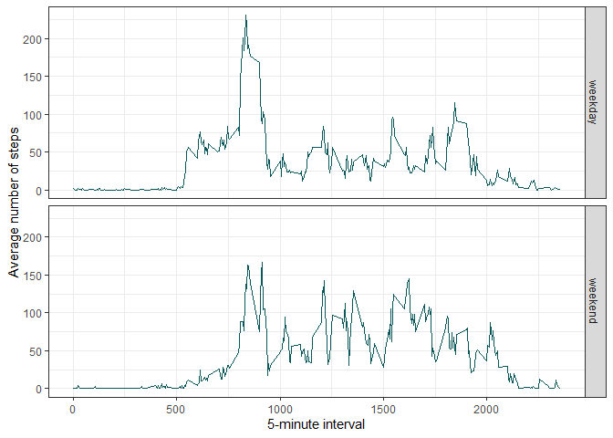

## 1. Loading and preprocessing the activity

#### 1.1 Code for reading in the activityset and/or processing the activity


```r
#' Packages 
library(dplyr)
library(ggplot2)
library(lubridate)
library(kableExtra)

unzip(zipfile = "activity.zip")
activity <- read.csv("activity.csv", sep = ",")

#' The date variable is transformed from factor type to date type
activity <- activity %>% mutate(date = ymd(date))
```


## 2. What is mean total number of steps taken per day?

#### 2.1 Calculate the total number of steps taken per day


```r
steps_days <- activity %>% 
  group_by(date) %>% 
  summarise(steps_days = sum(steps, na.rm = TRUE), .groups = 'drop')
knitr::kable(head(steps_days)) %>% 
  kable_styling(bootstrap_options = "striped", full_width = F)
```

<table class="table table-striped" style="width: auto !important; margin-left: auto; margin-right: auto;">
 <thead>
  <tr>
   <th style="text-align:left;"> date </th>
   <th style="text-align:right;"> steps_days </th>
  </tr>
 </thead>
<tbody>
  <tr>
   <td style="text-align:left;"> 2012-10-01 </td>
   <td style="text-align:right;"> 0 </td>
  </tr>
  <tr>
   <td style="text-align:left;"> 2012-10-02 </td>
   <td style="text-align:right;"> 126 </td>
  </tr>
  <tr>
   <td style="text-align:left;"> 2012-10-03 </td>
   <td style="text-align:right;"> 11352 </td>
  </tr>
  <tr>
   <td style="text-align:left;"> 2012-10-04 </td>
   <td style="text-align:right;"> 12116 </td>
  </tr>
  <tr>
   <td style="text-align:left;"> 2012-10-05 </td>
   <td style="text-align:right;"> 13294 </td>
  </tr>
  <tr>
   <td style="text-align:left;"> 2012-10-06 </td>
   <td style="text-align:right;"> 15420 </td>
  </tr>
</tbody>
</table>


#### 2.2 Histogram of the total number of steps taken each day


```r
ggplot(steps_days, aes(x = steps_days)) + 
  geom_histogram(bins = 30, color = 'white', fill = '#07575B') + 
  labs(
    title = 'Histogram of the total number of steps taken each day', 
    x = 'Total steps per day', y = ''
  ) + 
  theme_bw()
```

<!-- -->

#### 2.3 Calculate and report the mean and median of the total number of steps taken per day


```r
mean_median_steps_per_day <- steps_days %>% 
  summarise(
    mean = mean(steps_days, na.rm = TRUE),
    median = median(steps_days, na.rm = TRUE)
  )
knitr::kable(mean_median_steps_per_day) %>% 
  kable_styling(bootstrap_options = "striped", full_width = F)
```

<table class="table table-striped" style="width: auto !important; margin-left: auto; margin-right: auto;">
 <thead>
  <tr>
   <th style="text-align:right;"> mean </th>
   <th style="text-align:right;"> median </th>
  </tr>
 </thead>
<tbody>
  <tr>
   <td style="text-align:right;"> 9354.23 </td>
   <td style="text-align:right;"> 10395 </td>
  </tr>
</tbody>
</table>


## 3. What is the average daily activity pattern?

#### 3.1 Make a time series plot (i.e. type = "l") of the 5-minute interval (x-axis) and the average number of steps taken, averaged across all days (y-axis)


```r
interval_mean <- activity %>% 
  group_by(interval) %>% 
  summarise(mean = mean(steps, na.rm = TRUE), .groups = 'drop')
ggplot(interval_mean, aes(x = interval, y = mean)) + 
  geom_line(color = '#07575B') +
  labs(
    x = '5-minute intervals', 
    y = 'Average steps taken across all days'
  ) +
  theme_bw()
```

<!-- -->


#### 3.2 Which 5-minute interval, on average across all the days in the activityset, contains the maximum number of steps?


```r
knitr::kable(interval_mean[which.max(interval_mean$mean), ]) %>% 
  kable_styling(bootstrap_options = "striped", full_width = F)
```

<table class="table table-striped" style="width: auto !important; margin-left: auto; margin-right: auto;">
 <thead>
  <tr>
   <th style="text-align:right;"> interval </th>
   <th style="text-align:right;"> mean </th>
  </tr>
 </thead>
<tbody>
  <tr>
   <td style="text-align:right;"> 835 </td>
   <td style="text-align:right;"> 206.1698 </td>
  </tr>
</tbody>
</table>


## 4. Imputing missing values

Note that there are a number of days/intervals where there are missing values (coded as NA). The presence of missing days may introduce bias into some calculations or summaries of the data.

#### 4.1 Calculate and report the total number of missing values in the dataset (i.e. the total number of rows with NAs)


```r
rows_na <- activity[!complete.cases(activity), ]
nrow(rows_na)
```

```
## [1] 2304
```


#### 4.2 Devise a strategy for filling in all of the missing values in the dataset. The strategy does not need to be sophisticated. For example, you could use the mean/median for that day, or the mean for that 5-minute interval, etc.


```r
# Compute the mean for that 5-minute interval
median_day_for_NA <- activity %>% 
  group_by(interval) %>% 
  summarise(steps_NA = mean(steps, na.rm = TRUE), .groups = 'drop')
knitr::kable(head(median_day_for_NA)) %>% 
  kable_styling(bootstrap_options = "striped", full_width = F)
```

<table class="table table-striped" style="width: auto !important; margin-left: auto; margin-right: auto;">
 <thead>
  <tr>
   <th style="text-align:right;"> interval </th>
   <th style="text-align:right;"> steps_NA </th>
  </tr>
 </thead>
<tbody>
  <tr>
   <td style="text-align:right;"> 0 </td>
   <td style="text-align:right;"> 1.7169811 </td>
  </tr>
  <tr>
   <td style="text-align:right;"> 5 </td>
   <td style="text-align:right;"> 0.3396226 </td>
  </tr>
  <tr>
   <td style="text-align:right;"> 10 </td>
   <td style="text-align:right;"> 0.1320755 </td>
  </tr>
  <tr>
   <td style="text-align:right;"> 15 </td>
   <td style="text-align:right;"> 0.1509434 </td>
  </tr>
  <tr>
   <td style="text-align:right;"> 20 </td>
   <td style="text-align:right;"> 0.0754717 </td>
  </tr>
  <tr>
   <td style="text-align:right;"> 25 </td>
   <td style="text-align:right;"> 2.0943396 </td>
  </tr>
</tbody>
</table>


#### 4.3 Create a new dataset that is equal to the original dataset but with the missing data filled in.


```r
activity_NA <- data.frame()
for (i in unique(activity$interval)) {
  aux <- activity %>% filter(interval == i)
  aux_NA <- median_day_for_NA %>% filter(interval == i) %>% pull(steps_NA)
  for (j in seq_len(nrow(aux))) {
    if (is.na(aux[j, 1])) {
      aux[j, 1] <- round(aux_NA)
    } else {
      next
    }
  }
  activity_NA <- rbind(activity_NA, aux)
}
nrow(activity_NA[!complete.cases(activity_NA), ])
```

```
## [1] 0
```


#### 4.4 Make a histogram of the total number of steps taken each day and Calculate and report the mean and median total number of steps taken per day. Do these values differ from the estimates from the first part of the assignment? What is the impact of imputing missing data on the estimates of the total daily number of steps?


```r
steps_days_NA <- activity_NA %>% 
  group_by(date) %>% 
  summarise(steps_days = sum(steps, na.rm = TRUE), .groups = 'drop')
ggplot(steps_days_NA, aes(x = steps_days)) + 
  geom_histogram(bins = 30, color = 'white', fill = '#07575B') + 
  labs(
    title = 'Histogram of the total number of steps taken each day', 
    x = 'Total steps per day', y = ''
  ) + 
  theme_bw()
```

<!-- -->

```r
mean_median_steps_per_day_NA <- steps_days_NA %>% 
  summarise(
    mean = mean(steps_days, na.rm = TRUE),
    median = median(steps_days, na.rm = TRUE)
  )
knitr::kable(mean_median_steps_per_day_NA) %>% 
  kable_styling(bootstrap_options = "striped", full_width = F)
```

<table class="table table-striped" style="width: auto !important; margin-left: auto; margin-right: auto;">
 <thead>
  <tr>
   <th style="text-align:right;"> mean </th>
   <th style="text-align:right;"> median </th>
  </tr>
 </thead>
<tbody>
  <tr>
   <td style="text-align:right;"> 10765.64 </td>
   <td style="text-align:right;"> 10762 </td>
  </tr>
</tbody>
</table>
Mean and median values are higher after imputing missing data.


## 5. Are there differences in activity patterns between weekdays and weekends?

For this part the weekdays() function may be of some help here. Use the dataset with the filled-in missing values for this part.

#### 5.1 Create a new factor variable in the dataset with two levels – “weekday” and “weekend” indicating whether a given date is a weekday or weekend day.


```r
activity_NA <- activity_NA %>% 
  mutate(
    day = weekdays(date),
    week_day = factor(ifelse(weekdays(date) %in% c("Saturday", "Sunday"), 'weekend', 'weekday'))
  )
knitr::kable(head(activity_NA)) %>% 
  kable_styling(bootstrap_options = "striped", full_width = F)
```

<table class="table table-striped" style="width: auto !important; margin-left: auto; margin-right: auto;">
 <thead>
  <tr>
   <th style="text-align:right;"> steps </th>
   <th style="text-align:left;"> date </th>
   <th style="text-align:right;"> interval </th>
   <th style="text-align:left;"> day </th>
   <th style="text-align:left;"> week_day </th>
  </tr>
 </thead>
<tbody>
  <tr>
   <td style="text-align:right;"> 2 </td>
   <td style="text-align:left;"> 2012-10-01 </td>
   <td style="text-align:right;"> 0 </td>
   <td style="text-align:left;"> Monday </td>
   <td style="text-align:left;"> weekday </td>
  </tr>
  <tr>
   <td style="text-align:right;"> 0 </td>
   <td style="text-align:left;"> 2012-10-02 </td>
   <td style="text-align:right;"> 0 </td>
   <td style="text-align:left;"> Tuesday </td>
   <td style="text-align:left;"> weekday </td>
  </tr>
  <tr>
   <td style="text-align:right;"> 0 </td>
   <td style="text-align:left;"> 2012-10-03 </td>
   <td style="text-align:right;"> 0 </td>
   <td style="text-align:left;"> Wednesday </td>
   <td style="text-align:left;"> weekday </td>
  </tr>
  <tr>
   <td style="text-align:right;"> 47 </td>
   <td style="text-align:left;"> 2012-10-04 </td>
   <td style="text-align:right;"> 0 </td>
   <td style="text-align:left;"> Thursday </td>
   <td style="text-align:left;"> weekday </td>
  </tr>
  <tr>
   <td style="text-align:right;"> 0 </td>
   <td style="text-align:left;"> 2012-10-05 </td>
   <td style="text-align:right;"> 0 </td>
   <td style="text-align:left;"> Friday </td>
   <td style="text-align:left;"> weekday </td>
  </tr>
  <tr>
   <td style="text-align:right;"> 0 </td>
   <td style="text-align:left;"> 2012-10-06 </td>
   <td style="text-align:right;"> 0 </td>
   <td style="text-align:left;"> Saturday </td>
   <td style="text-align:left;"> weekend </td>
  </tr>
</tbody>
</table>


#### 5.2 Make a panel plot containing a time series plot (i.e. type = "l") of the 5-minute interval (x-axis) and the average number of steps taken, averaged across all weekday days or weekend days (y-axis). See the README file in the GitHub repository to see an example of what this plot should look like using simulated data.


```r
mean_steps <- activity_NA %>% 
  group_by(interval, week_day) %>% 
  summarise(average = mean(steps), .groups = 'drop')
ggplot(mean_steps, aes(x = interval, y = average)) + 
  geom_line(color = '#07575B') + 
  labs(
    x = '5-minute interval',
    y = 'Average number of steps'
  ) + facet_grid(week_day ~ .) + theme_bw()
```

<!-- -->


